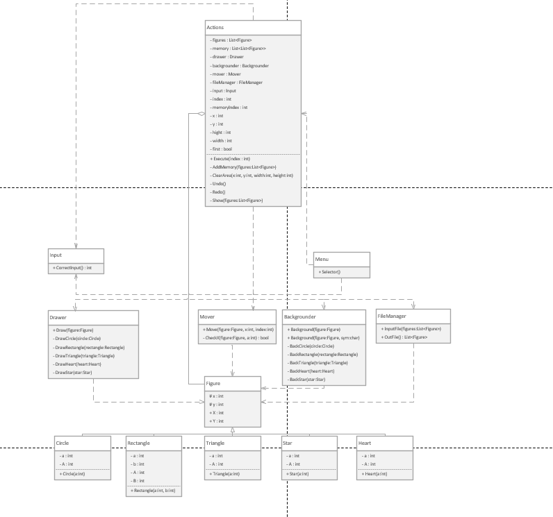

# OOP

Коваленко Александр

# Work №1 "Basic OOP principles"

Консольный Paint — это упрощенная версия графического редактора, работающая в текстовом режиме командной строки (консоли). В отличие от классического Paint, использующего для рисования графический интерфейс и мышь, консольный Paint использует текстовые символы для создания изображений.

